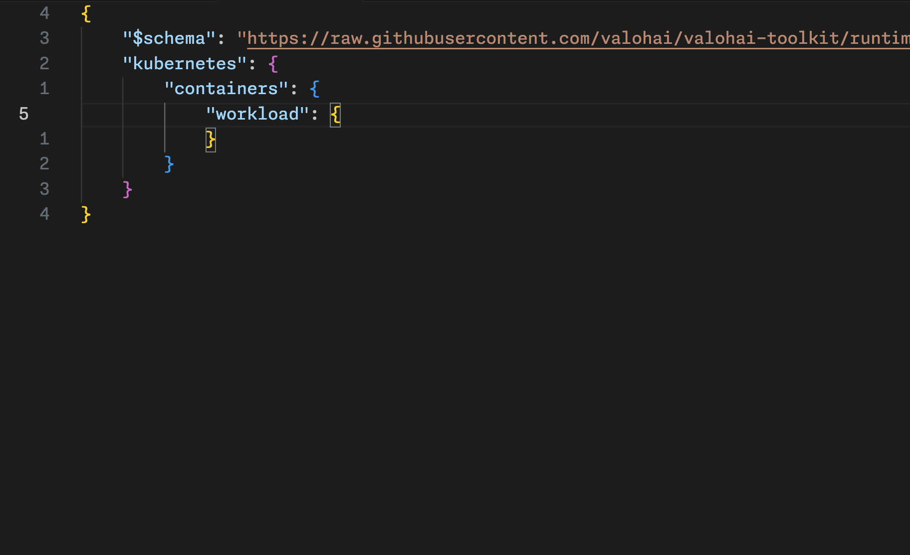
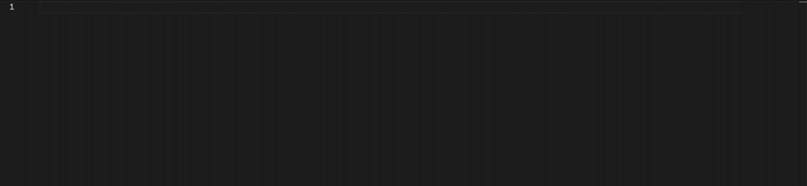
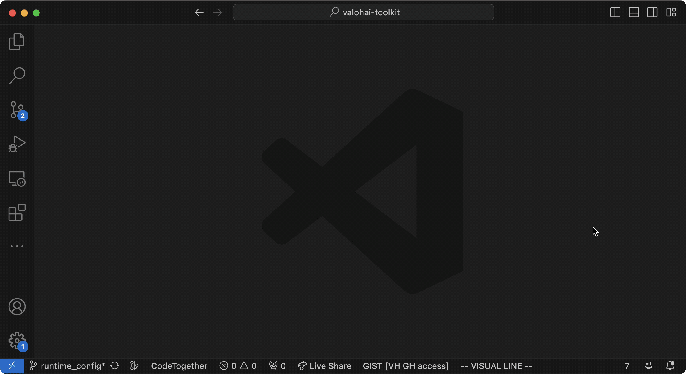

# Execution `runtime_config` Schema

This schema helps you write and validate a runtime configuration for an execution.

## Editing a Runtime Config

Using the schema, VS Code will offer suggestions when you press `Ctrl + Space`. It will also notify you if the config is invalid and let you know what the allowed values are.



## Configuration (VS Code)

You can define the schema in your JSON file by starting with this template:

```json
{
    "$schema": "https://raw.githubusercontent.com/valohai/valohai-toolkit/master/schemas/runtime_config/runtime_config.json",
}
```



Alternatively, you can configure VS Code to use the schema automatically for certain files by adding the following to your VS Code `settings.json` file:

```json
"json.schemas": [
    {
      "fileMatch": [
        "*_runtime_config.json"
      ],
      "url": "https://raw.githubusercontent.com/valohai/valohai-toolkit/master/schemas/runtime_config/runtime_config.json"
    }
]
```

This example uses the schema for all files with the filename ending in `_runtime_config.json` (for example, `my_test_runtime_config.json`).

You can define this in either the user settings (will apply globally) or in a workspace (applies to only files inside that workspace).



## Limitations

A JSON Schema cannot compare values in the JSON document, for example to check that a limit is not smaller than the corresponding request, so these things are not checked.
